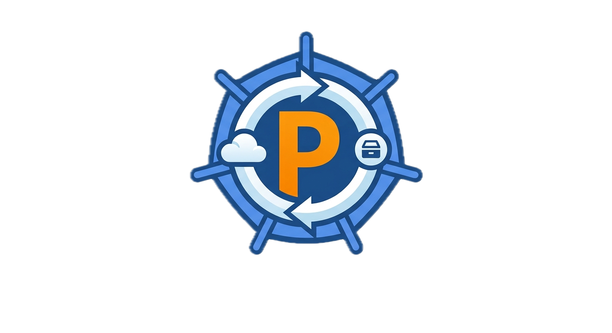
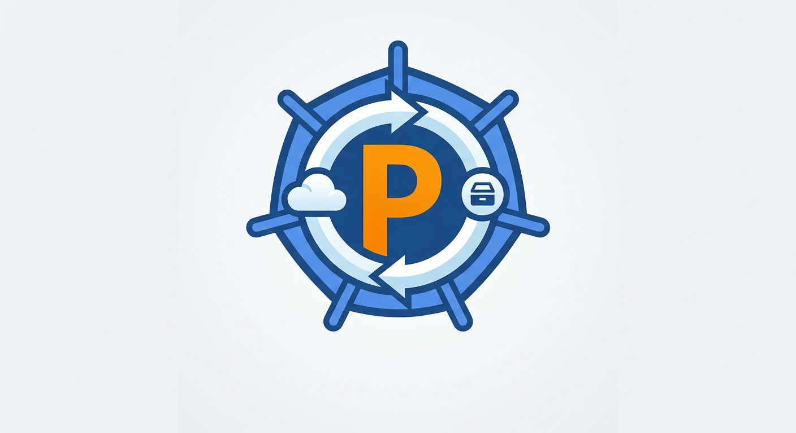
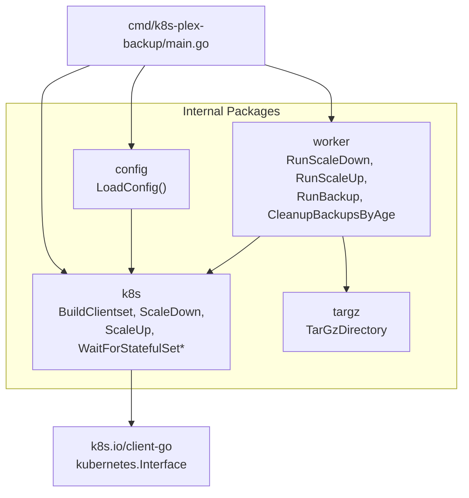
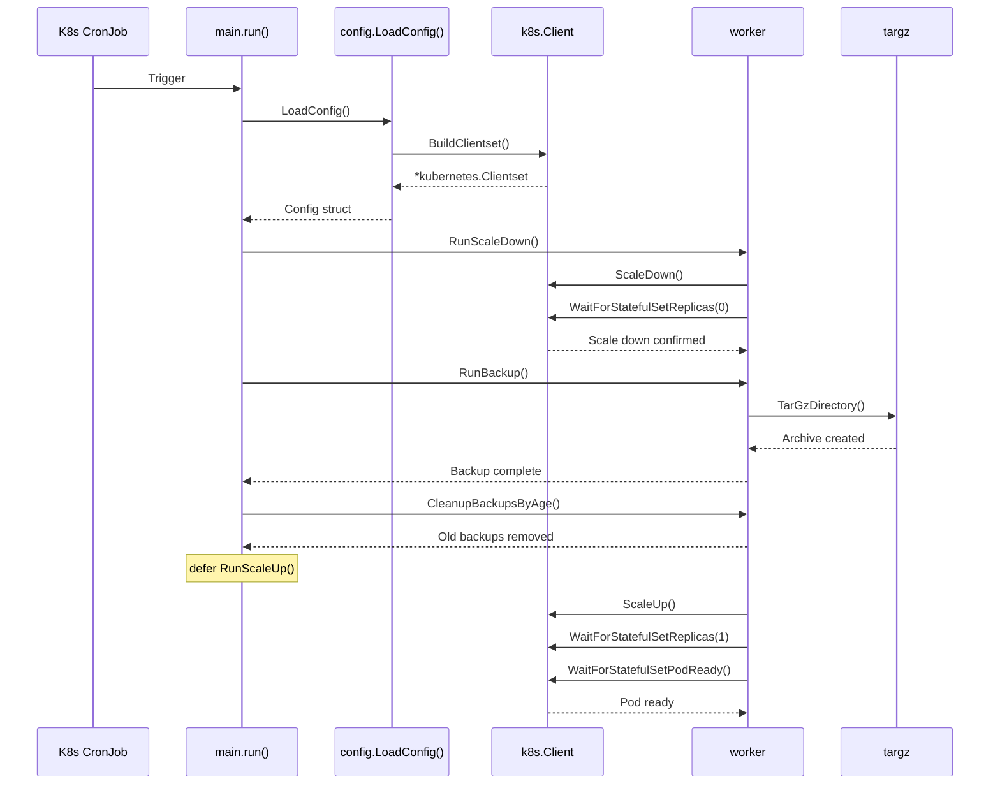

<h1 align="center">
  
  k8s-plex-backup
</h1>



[](https://github.com/mainmain-rl/k8s-plex-backup/actions/workflows/build_and_push.yaml)
[](https://github.com/mainmain-rl/k8s-plex-backup/actions/workflows/pre-commit.yaml)
[](https://github.com/mainmain-rl/k8s-plex-backup/actions/workflows/dependabot/dependabot-updates)

A Kubernetes-native backup tool for Plex media server StatefulSets, works perfectly with the official [Plex helm chart](https://github.com/plexinc/pms-docker).

## Overview

This tool performs a zero-downtime backup of a Plex StatefulSet by:

1. [Scaling down](/internal/worker/worker.go#RunScaleDown) the StatefulSet to 0 replicas
2. Creating a compressed [tar.gz archive](/internal/worker/worker.go#RunBackup) of the Plex data directory
3. [Cleanup the backups](/internal/worker/worker.go#CleanupBackupsByAge) older than the RETENTION_DAYS env variable
4. [Scaling back up](/internal/worker/worker.go#RunScaleUp) to 1 replica (def func to avoid service restart issues)

## Requirements

- Kubernetes cluster access (in-cluster or via kubeconfig)
- Go 1.26+
- mise 2025.10.21+

## Configuration

Set these environment variables:

| Variable | Description | Default |
| -------- | ----------- | ------- |
| `PLEX_NAMESPACE` | Namespace containing the Plex StatefulSet | Required |
| `PLEX_STATEFULSET_NAME` | Name of the Plex StatefulSet | Required |
| `SOURCE_DIRECTORY` | Path to the Plex data directory to backup | Required |
| `DESTINATION_DIRECTORY` | Directory where backup archives will be stored | Required |
| `SCALE_DOWN_TIMEOUT` | Timeout for scaling down StatefulSet | 5m |
| `SCALE_UP_TIMEOUT` | Timeout for scaling up StatefulSet | 10m |
| `RETENTION_DAYS` | Number of days for Cleanup Backup | 14 |
| `PLEX_EXCLUDED_DIRS` | Excluded Directories or Files for the backup | ["Cache", "Codecs", "Crash Reports"] |
| `FLUXCD_OPTION` | Set the Flux reconciliation annotation while Plex is scaled down | false |
| `ARGOCD_OPTION` | Set the Argo CD skip-reconcile annotation while Plex is scaled down | false |

## Usage

```bash
# Build the binary
go build -o k8s-plex-backup ./cmd/k8s-plex-backup

# Run with environment variables
export PLEX_NAMESPACE=media
export PLEX_STATEFULSET_NAME=plex
export SOURCE_DIRECTORY=/data/plex
export DESTINATION_DIRECTORY=/backups
./k8s-plex-backup
```

## How It Works

1. **Scale Down**: The StatefulSet is scaled to 0 replicas, stopping the Plex service
2. **Backup**: A compressed tar.gz archive is created of the source directory with timestamp naming (e.g., `plex_backup_20240101_150405.tar.gz`)
3. **Scale Up**: The StatefulSet is restored to 1 replica, resuming the Plex service

## Architecture

### Package-Level Interconnection Diagram



### Process Flow Diagram



### Key Interconnections

| Source | Targets | Purpose |
|--------|---------|---------|
| `main.go` | `config`, `worker`, `k8s` | Orchestrates the entire backup flow |
| `config.go` | `k8s` | Builds the Kubernetes client |
| `worker.go` | `k8s`, `targz` | Coordinates scaling and archiving |
| `k8s/client.go` | *(none internal)* | Loads in-cluster or kubeconfig |
| `k8s/statefulset.go` | *(none internal)* | StatefulSet scaling logic |
| `targz/targz.go` | *(none internal)* | Standalone archiving logic |

### Design Observations

- **Clean layering**: `targz` and `k8s/client` are leaf packages with no internal dependencies.
- **Worker as hub**: `worker.go` is the central orchestrator that bridges Kubernetes operations and file archiving.
- **Config dependency**: `config.go` depends on `k8s.go` only for `BuildClientset()`, keeping configuration loading separate from Kubernetes business logic.

## Notes

- Files that can't be read due to permission errors are skipped with a warning but you have to managed the [container rights](/manifest/example.yaml#spec.securityContext)
- The tool uses the in-cluster Kubernetes config when running inside a pod, or falls back to `~/.kube/config`
- Timeout values can be adjusted via environment variables for different cluster sizes
- Backup retention days can be adapt with the env variable
